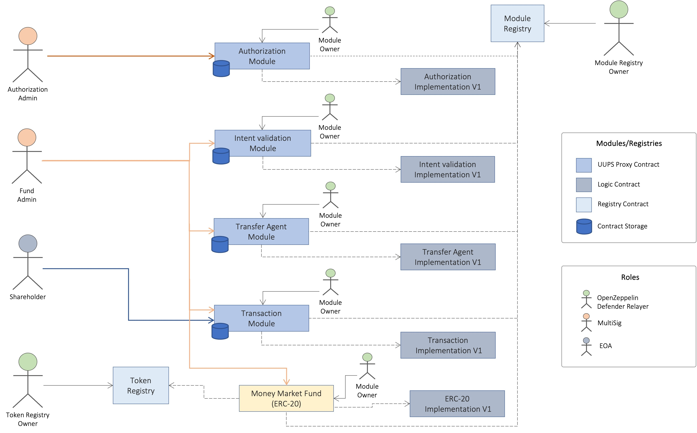

# Benji Solidity Smart Contracts

This repository contains Solidity Smart Contracts for EVM compatible blockchains implemented for Benji, the world’s first tokenized money fund that is natively issued on blockchains. 
It's offered and operated by Franklin Distributors, LLC, part of the Franklin Templeton global asset management organization.

Franklin Resources, Inc. [NYSE:BEN] is a global investment management organization with subsidiaries operating as Franklin Templeton and serving clients in over 165 countries. Franklin Templeton’s mission is to help clients achieve better outcomes through investment management expertise, wealth management and technology solutions. Through its specialist investment managers, the company brings extensive capabilities in equity, fixed income, multi-asset solutions and alternatives. With offices in more than 30 countries and approximately 1,300 investment professionals, the California-based company has over 70 years of investment experience.

## Smart Contracts Architecture
The diagram below is a representation of the main roles and blocks of the system and their dependencies. Every block represents a smart contract that serves a specific functionality within the system such as:
  - Registry
  - Module (UUPS)
  - Token (UUPS)

Module contracts contain most of the business logic required to operate the tokenized fund. Our implementation of modules provides upgradeability via the Universal Upgradeable Proxy Standard as described in the EIP-1822.\
Registry contracts are intended for storage of valid addresses of modules or tokens that are part of the system. Within modules the registries are mainly used as dictionaries to get valid addresses of other modules to interact with.\
Finally the token contract is ERC-20 compliant where shareholder balances are kept. Due to regulations transfers of tokens are disabled for shareholder accounts but this could change in the future.

## Smart Contracts Auditors Review
Smart contracts source code has been audited by [Trail Of Bits](https://www.trailofbits.com/) as of September 2023. Detailed report can be accessed [here](https://github.com/trailofbits/publications#ethereumevm).

## Releases

### v1.0
  - Initial version of the Smart Contracts

## Contributing
This repository is not an open source project and we do not accept Pull Requests being raised. The ones created will be auto-closed.

## License
Released under [BSL-1.1](LICENSE)
